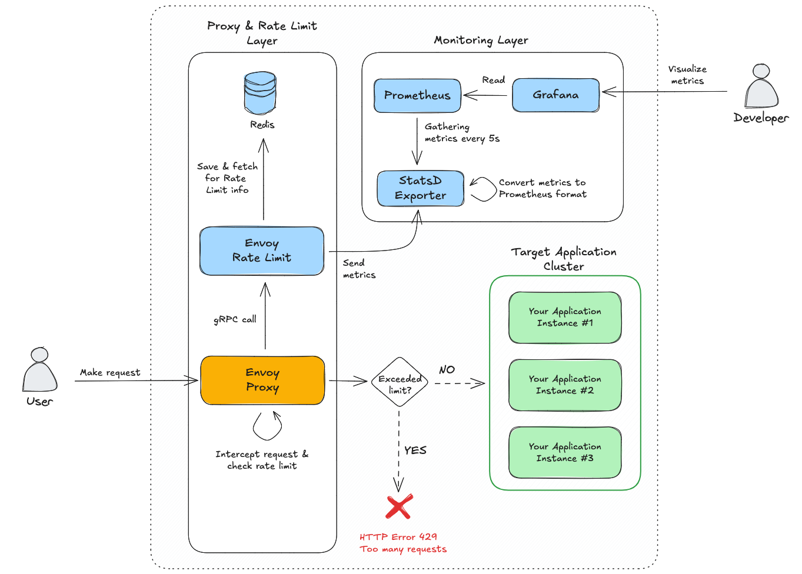
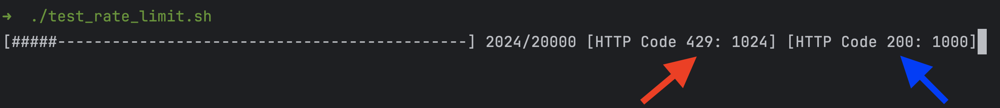

# Rate Limit com Envoy Proxy
## Introdução
Essa solução demonstra a utilização de rate limit com Envoy. O rate limit é uma funcionalidade que permite limitar a quantidade de requisições que um serviço pode receber em um determinado período de tempo. O rate limit pode ser aplicado em diferentes níveis, como por exemplo, por serviço, por usuário, por IP, etc.

## Arquitetura


#### Componentes da Arquitetura
| **Componente**               | **Descrição**                                                                                                                                                                               |
|-----------------------------|---------------------------------------------------------------------------------------------------------------------------------------------------------------------------------------------|
| **Envoy Proxy**              | Intercepta as requisições antes de encaminhá-las para a aplicação. Verifica se a requisição excede os limites definidos.                                                                    |
| **Envoy Rate Limit**         | Serviço responsável por verificar se uma requisição excede o limite permitido, baseado nos dados armazenados no Redis. Se o limite for excedido, retorna erro `HTTP 429 Too Many Requests`. |
| **Redis**                    | Banco de dados utilizado para armazenar informações de Rate Limiting, como contadores de requisições por usuário.                                                                           |
| **StatsD Exporter**          | Converte as métricas enviadas pelo Envoy Rate Limit para o formato compatível com Prometheus.                                                                                               |
| **Prometheus**               | Coleta as métricas do StatsD Exporter a cada 5 segundos e as armazena para análise e monitoramento.                                                                                         |
| **Grafana**                  | Visualiza as métricas coletadas pelo Prometheus e apresenta dashboards para acompanhamento do Rate Limiting.                                                                                |
| **Target Application Cluster** | Conjunto de instâncias da aplicação de destino. Se a requisição estiver dentro do limite, o Envoy Proxy a encaminha para uma dessas instâncias.                                             |

## Configurando e Inicializando a Solução
Siga os passos abaixo para inicializar e configurar a solução de Rate Limit:

### Passo 1: Subir os Contêineres com Docker Compose
Acesse o diretório raiz da solução e execute o seguinte comando para construir e iniciar todos os contêineres:

```bash
$ docker-compose up --build
```

### Passo 2: Criar o dashboard no Grafana
Acesse o Grafana em `http://localhost:3000` e faça login com as credenciais padrão `admin:admin`. Em seguida, adicione o Prometheus como fonte de dados e importe o dashboard localizado em `grafana/dashboard.json`.

### Passo 3: Testar o Rate Limit
Execute o seguinte comando para testar o Rate Limit:

```bash
chmod +x test_rate_limit.sh
./test_rate_limit.sh
```

O script `test_rate_limit.sh` envia 20000 requisições para o Envoy. As primeiras 500 requisições a cada minuto são permitidas, enquanto as 5 últimas são bloqueadas com erro `HTTP 429 Too Many Requests`.



## FAQ
### O que é Envoy?
Envoy é um proxy de borda de alto desempenho e código aberto, projetado para aplicações modernas de microsserviços. Ele foi projetado para ser distribuído, resiliente, inteligente e altamente configurável.

### O que é Rate Limit?
Rate Limit é uma funcionalidade que permite limitar a quantidade de requisições que um serviço pode receber em um determinado período de tempo. O rate limit pode ser aplicado em diferentes níveis, como por exemplo, por serviço, por usuário, por IP, etc.

### Por que usar Rate Limit?
O Rate Limit é uma técnica importante para proteger serviços de abusos e ataques de negação de serviço (DDoS). Ele também pode ser utilizado para garantir a qualidade de serviço (QoS) e evitar que um único usuário ou serviço monopolize os recursos disponíveis.

### Como o Rate Limit funciona?
O Rate Limit funciona verificando se uma requisição excede o limite permitido. Se o limite for excedido, o Rate Limit retorna um erro `HTTP 429 Too Many Requests`. Caso contrário, a requisição é encaminhada para o serviço de destino.

### Como o Rate Limit é implementado?
O Rate Limit é implementado utilizando um proxy como Envoy. O Envoy intercepta as requisições antes de encaminhá-las para a aplicação. Ele verifica se a requisição excede os limites definidos e, se necessário, bloqueia a requisição.

